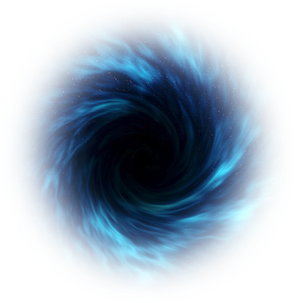

<h1 align="center" style="border-bottom: none;">Gravity</h1>
<h3 align="center">Terraform dynamic state-driver</h3>

  
  <h5 align="center">Today in history (Apr 10, 2019): the first photograph of a black hole was released (not pictured)</h5>

## Goal

The Terraform binary functions as a barrier that definitions must pass through
in order to be instantiated into real infrastructure, and once this happens
successfully the state is stored remotely. This means the state of the
infrastructure can drift in between runs of the Terraform binary's `apply`
command. In essence, we want to check the current state continuously and take
action to pull the infrastructure back into the desired state. Thus, the name
_Gravity_.

## Features

- Continuous scanning of environmental drift from desired state
- Take action to return to desired state
- Create short-lived clone of the infrastructure based on branch
